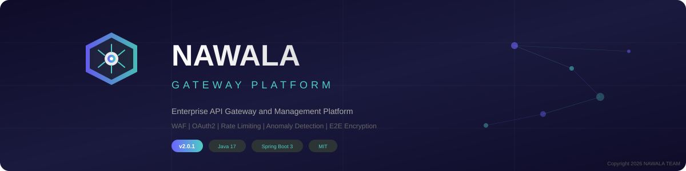

<p align="center">
  
</p>

<h1 align="center">&#x1F680; Nawala &#x2014; Enterprise API Gateway & Management Platform</h1>

<p align="center">
  <strong>Open-source API Gateway with built-in WAF, OAuth2, Rate Limiting, Anomaly Detection, and End-to-End Encryption.</strong><br/>
  Built with Java 17 + Spring Boot 3 + Spring Cloud Gateway.
</p>

<p align="center">
  <a href="#-features">Features</a> &#x2022;
  <a href="#-architecture">Architecture</a> &#x2022;
  <a href="#-quick-start">Quick Start</a> &#x2022;
  <a href="#-configuration">Configuration</a> &#x2022;
  <a href="#-security">Security</a> &#x2022;
  <a href="#-contributing">Contributing</a> &#x2022;
  <a href="#-license">License</a>
</p>

<p align="center">
  
  
  
  
  
  
</p>

<p align="center">
  <a href="https://github.com/nawala-team/nawala-gateway-platform/releases/latest">
    
  </a>
  <a href="https://github.com/nawala-team/nawala-gateway-platform/actions">
    
  </a>
  <a href="https://github.com/nawala-team/nawala-gateway-platform/stargazers">
    
  </a>
</p>

<p align="center">
  <a href="https://saweria.co/rdpf">
    
  </a>
</p>

---

## &#x1F4D6; What is Nawala?

**Nawala** (from Sanskrit: "komunikasi / pesan") is a full-featured, production-ready **API Gateway** and **API Management Platform** designed for startups, enterprises, and developers who need secure, scalable, and intelligent API routing without vendor lock-in.

Unlike cloud-only solutions (AWS API Gateway, Apigee, Kong Enterprise), Nawala runs **entirely self-hosted** &#x2014; giving you full control over your data, traffic, and security policies.

| Problem | Nawala Solution |
|---------|----------------|
| Cloud API Gateways are expensive at scale | Self-hosted, zero licensing cost |
| Complex multi-tool setups | All-in-one platform |
| No visibility into API anomalies | Built-in anomaly detection |
| Sensitive data exposed in transit | AES-256-GCM end-to-end payload encryption |
| Backend URLs exposed to clients | URL masking / path rewriting |
| No easy API lifecycle management | Full web console with MVVM architecture |

---
---

## &#x26A1; Features

### &#x1F510; Security & Authentication
- **Multi-Auth Support** &#x2014; API Key, JWT Bearer Token, OAuth2 Client Credentials
- **API Key Management** &#x2014; Generate, rotate (24h grace period), revoke, scoped (IP/method/route)
- **OAuth2 Server** &#x2014; Client registration, token issue/refresh/revoke/introspect (RFC 6749)
- **Web Application Firewall (WAF)** &#x2014; SQL injection, XSS, path traversal + custom rules
- **AES-256-GCM Encryption** &#x2014; Database field encryption + end-to-end payload encryption
- **Internal API Security** &#x2014; Shared-secret header validation for service-to-service calls

### &#x1F6A6; Traffic Management
- **Tiered Rate Limiting** &#x2014; FREE / STARTER / PROFESSIONAL / ENTERPRISE / UNLIMITED
- **Multi-Window Rate Limit** &#x2014; Per-minute, per-hour, per-day sliding windows
- **Circuit Breaker** &#x2014; CLOSED &#x2192; OPEN &#x2192; HALF_OPEN with configurable thresholds
- **Load Balancer** &#x2014; Round-robin + canary routing with weighted distribution
- **Response Caching** &#x2014; Configurable TTL per route
- **Request/Response Transformation** &#x2014; Header injection, body transformation pipeline

### &#x1F9E0; Intelligence & Monitoring
- **Anomaly Detection** &#x2014; Spike detection, brute force detection, unusual hour analysis
- **Auto-Block** &#x2014; Threats automatically blocked at gateway level
- **Health Monitor** &#x2014; Scheduled health checks with UP/DOWN/DEGRADED tracking
- **Real-time Analytics** &#x2014; Traffic, response times, status distribution, geo, hourly patterns
- **Structured Logging** &#x2014; JSON format, separated files (app/error/security/access/health)

### &#x1F9E9; Extensibility
- **Plugin System** &#x2014; JavaScript hooks (PRE_REQUEST, POST_RESPONSE, ERROR_HANDLER, SCHEDULER)
- **Webhooks** &#x2014; Event notifications with HMAC signing and exponential backoff retry
- **Mock/Sandbox** &#x2014; Create mock endpoints for development and testing
- **API Documentation** &#x2014; Built-in OpenAPI spec hosting with publish/unpublish workflow


### &#x1F4CA; Competitive Comparison

| Feature | Kong | AWS API GW | Apigee | **Nawala** |
|---------|:----:|:----------:|:------:|:----------:|
| Self-hosted + Free | &#x2705; | &#x274C; | &#x274C; | &#x2705; |
| Built-in WAF | &#x274C; | Separate | &#x274C; | &#x2705; |
| Anomaly Detection | &#x274C; | &#x274C; | &#x274C; | &#x2705; |
| Payload Encryption (E2E) | &#x274C; | &#x274C; | &#x274C; | &#x2705; |
| URL Masking | &#x274C; | &#x274C; | &#x274C; | &#x2705; |
| Plugin System (JS) | Lua | &#x274C; | &#x274C; | &#x2705; |
| Full Web Console | Paid | AWS Console | Paid | &#x2705; |
| Canary Routing | Paid | &#x274C; | Paid | &#x2705; |

---

## &#x1F3D7;&#xFE0F; Architecture

### Tech Stack

| Layer | Technology |
|-------|-----------|
| Language | Java 17 (LTS) |
| Framework | Spring Boot 3.2.5 |
| Gateway | Spring Cloud Gateway (Reactive/WebFlux) |
| Frontend | Thymeleaf + Custom CSS + Vanilla JS |
| Database | MySQL 8.0 |
| Cache | Redis 7.x |
| Security | Spring Security 6 + BCrypt(12) + AES-256-GCM |
| Build | Maven (Multi-module) |
| Logging | Logback + SLF4J (JSON structured) |
| Pattern | MVVM (Model-View-ViewModel) |

---

## &#x1F680; Quick Start

### Prerequisites

| Software | Version | Required |
|----------|---------|----------|
| Java JDK | 17+ | &#x2705; |
| Maven | 3.8+ | &#x2705; |
| MySQL | 8.0+ | &#x2705; |
| Redis | 7.x | &#x2705; |
| Git | 2.x | &#x2705; |

### Installation

```bash
# 1. Clone the repository
git clone https://github.com/nawala-team/nawala-gateway-platform.git
cd nawala-gateway-platform

# 2. Create MySQL database
mysql -u root -e "CREATE DATABASE nawala_db CHARACTER SET utf8mb4 COLLATE utf8mb4_unicode_ci;"

# 3. Start Redis
redis-server

# 4. Build the project
./mvnw clean package -DskipTests

# 5. Start Platform (Management Console)
java -jar platform/target/nawala-platform-2.0.1.jar

# 6. Start Gateway (separate terminal)
java -jar gateway/target/nawala-gateway-2.0.1.jar
```

### Service Endpoints

| Service | Port | Description |
|---------|------|-------------|
| Platform Console | `:8080` | Web management UI |
| API Gateway | `:9090` | Gateway routing endpoint |
| Default Admin | `admin` / `admin123` | Change immediately after first login! |


---

## &#x2699;&#xFE0F; Configuration

### Platform (`application.properties`)

```properties
spring.datasource.url=jdbc:mysql://<DB_HOST>:3306/nawala_db?useSSL=false&serverTimezone=Asia/Jakarta
spring.datasource.username=<DB_USER>
spring.datasource.password=<DB_PASS>
nawala.encryption.key=<YOUR_BASE64_AES_256_KEY>
nawala.internal.secret=<YOUR_INTERNAL_SECRET>
```

### Gateway (`application.properties`)

```properties
nawala.gateway.platform-url=http://<PLATFORM_HOST>:8080
nawala.gateway.internal-secret=<YOUR_INTERNAL_SECRET>
nawala.gateway.jwt.secret=<YOUR_BASE64_JWT_SECRET>
nawala.gateway.payload-key=<YOUR_BASE64_AES_256_KEY>
spring.data.redis.host=<REDIS_HOST>
spring.data.redis.port=6379
```

### Generate Secure Keys

```bash
openssl rand -base64 32   # AES-256 key
openssl rand -base64 64   # JWT secret
openssl rand -hex 32      # Internal secret
```

---

## &#x1F512; Security

### Encryption Layers

| Layer | Algorithm | Purpose |
|-------|-----------|---------|
| Database Fields | AES-256-GCM | Encrypt PII (email, phone, URLs) |
| Passwords | BCrypt (cost=12) | Password hashing |
| API Keys | BCrypt + SecureRandom | Key storage |
| Payload (E2E) | AES-256-GCM | Request/response body encryption |
| Sessions | JSESSIONID + HttpOnly | Session management |

### API Authentication Methods

```bash
# API Key
curl -H "X-API-Key: nwl_YOUR_KEY_HERE" http://<GATEWAY>:9090/api/v1/users

# JWT Bearer
curl -H "Authorization: Bearer YOUR_JWT_TOKEN" http://<GATEWAY>:9090/api/v1/users

# OAuth2 Client Credentials
curl -X POST http://<GATEWAY>:9090/oauth/token \
  -d "grant_type=client_credentials&client_id=ID&client_secret=SECRET"
```


---

## &#x1F4DD; Logging

Structured ISO 8601 JSON logging with separated files:

```
logs/
├── platform/
│   ├── application.log    # General (JSON)
│   ├── error.log          # ERROR only
│   ├── security.log       # Auth & threats
│   ├── access.log         # HTTP access
│   ├── health.log         # Health checks
│   └── archive/           # Rotated (.gz)
└── gateway/
    ├── application.log
    ├── error.log
    ├── security.log
    ├── access.log
    └── archive/
```

---

## &#x1F4C2; Project Structure

```
nawala-gateway-platform/
├── pom.xml                    # Parent POM (multi-module)
├── platform/                  # Management Console
│   └── src/main/java/id/nawala/platform/
│       ├── config/            # Security, Encryption, Scheduling
│       ├── controller/        # MVC controllers
│       ├── model/             # JPA entities
│       ├── repository/        # Spring Data repositories
│       ├── service/impl/      # Service implementations
│       ├── util/              # Encryption utilities
│       └── viewmodel/         # MVVM view models
├── gateway/                   # API Gateway (Reactive)
│   └── src/main/java/id/nawala/gateway/
│       ├── circuitbreaker/    # Circuit breaker registry
│       ├── config/            # Routing & security
│       ├── filter/            # Gateway filters
│       └── logging/           # Gateway logging
└── logs/                      # Separated log output
```

---

## &#x1F91D; Contributing

See [CONTRIBUTING.md](CONTRIBUTING.md) for detailed guidelines.

---

## &#x2615; Support This Project

<p align="center">
  <a href="https://saweria.co/rdpf">
    
  </a>
</p>

---

## &#x1F4DC; License

Copyright &#x00A9; 2026 **NAWALA TEAM**. All rights reserved.

Licensed under the [MIT License](LICENSE). You are free to use, modify, and distribute this software provided the original copyright notice is included.

---

## &#x1F4DA; Full Documentation

For detailed feature-by-feature usage guide, see **[docs/DOCUMENTATION.md](docs/DOCUMENTATION.md)**.

---

<p align="center">Made with &#x2764;&#xFE0F; by <strong>NAWALA TEAM</strong> in Indonesia &#x1F1EE;&#x1F1E9;</p>
<p align="center"><sub>Nawala &#x2014; Secure Your APIs, Empower Your Platform.</sub></p>
<p align="center"><sub>Copyright &#x00A9; 2026 NAWALA TEAM. Licensed under MIT.</sub></p>

